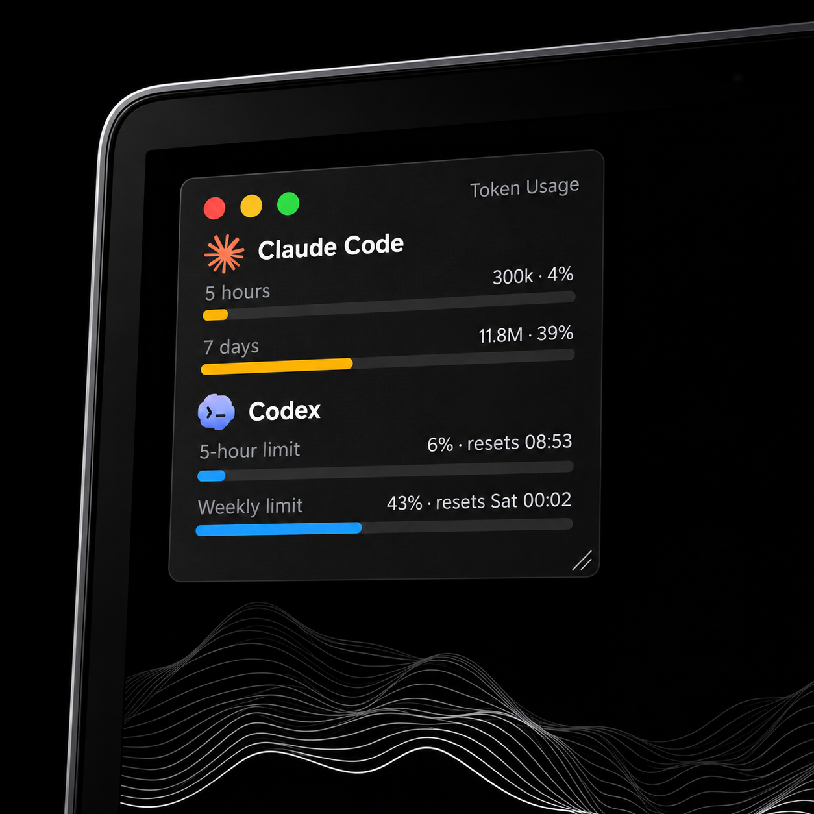
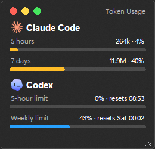

# Usage Deck

**See your Claude Code and Codex usage at a glance, right on your Windows desktop.**

A small always-on-top widget that shows how much of your 5-hour and weekly limits you've used, so you
stop guessing and stop getting cut off mid-task.



## Features

- **Codex:** your real 5-hour and weekly limit percentages, with reset times.
- **Claude Code:** tokens used in the last 5 hours and 7 days, plus today, as bars.
- **Zero setup:** no login, no API key, no network. It reads the logs the CLIs already write.
- **Works with one or both:** each tool shows only if it's installed, and you can hide either from the right-click menu.
- **Looks native:** dark, rounded, slightly frosted glass, with Mac-style window buttons.
- **Stays out of the way:** drag it anywhere, resize it, minimize it, or switch to compact view.
- **Pin it and forget it:** taskbar button, custom icon, optional start with Windows.

<details>
<summary>Actual screenshot</summary>



</details>

## Quick start

Requires Windows 10/11 and [Python 3.9+](https://www.python.org/downloads/). No packages to install.

```
git clone https://github.com/CreativeChonker/usage-deck.git
cd usage-deck
py widget.py
```

Prefer an app you can pin to the taskbar? Run `build.bat` to create `UsageDeck.exe`, launch it, then
right-click its taskbar button and choose **Pin to taskbar**. To start with Windows, run
`powershell -ExecutionPolicy Bypass -File install-startup.ps1`.

## Connect it to Claude Code and Codex

There is nothing to log into and no API key. Usage Deck reads the session logs the two CLIs already
write to disk:

| Tool | Where it reads | Override with |
|------|----------------|---------------|
| Claude Code | `%USERPROFILE%\.claude\projects` | `CLAUDE_CONFIG_DIR` env var |
| Codex CLI | `%USERPROFILE%\.codex\sessions` | `CODEX_HOME` env var |

1. Install and use Claude Code and/or the Codex CLI at least once, so the log folders exist.
2. Run Usage Deck. Numbers appear as soon as there are sessions.
3. If your logs live somewhere else (for example inside WSL), set the env var above to that location.

Only the CLIs and IDE extensions that write these logs are counted. Chats on claude.ai or chatgpt.com are not.

## Using it

| Action | How |
|--------|-----|
| Move | Drag anywhere |
| Resize | Drag the grip in the bottom-right corner |
| Close / minimize / compact | Red / yellow / green dots (hover to see the symbols) |
| Show or hide Claude Code or Codex | Right-click, then tick or untick |
| Refresh now | Right-click, then Refresh now (it also updates every 30 seconds) |

## Customize

- **Logos / icon:** put `claude.svg`, `codex.svg` and `app.svg` (or PNGs) in `logos/`. SVGs are converted
  automatically using Microsoft Edge (already on Windows). `app.svg` becomes the window and `.exe` icon.
- **Settings:** `config.json` is created next to the app on first move. Keys: `w` (width), `compact`,
  `show_claude` / `show_codex` (`true`, `false`, or `null` for auto), `claude_5h_cap`, `claude_7d_cap`.
- **Style:** right-click and choose **Glass** (slightly see-through, blurred) or **Pure black** (solid). The choice is saved as `glass` in `config.json`. Colors and glass strength (`GLASS_ALPHA`) are at the top of `widget.py`.

## Good to know

- **Privacy:** everything is read from local files. There are no network calls and nothing leaves your machine.
- **Claude bars are relative:** Claude Code's logs don't include your plan limit, so the bars show usage
  against a cap you can set (`claude_5h_cap` defaults to your own busiest 5-hour window, `claude_7d_cap`
  to 30M). They are not official limits.
- **Codex percentages** come from Codex's own logs, so they only update while Codex is being used.
- Claude counts input, output and cache-write tokens; cache reads are excluded.
- A self-built `.exe` isn't code-signed, so Windows SmartScreen may warn the first time. Running from source avoids it.

## Contributing

Issues and pull requests are welcome. The whole app is one file, `widget.py`, using only the Python standard library.

## Trademarks

The Claude and Codex logos in `logos/` are trademarks of their respective owners (Anthropic and OpenAI)
and are used only to identify the services. This project is not affiliated with or endorsed by them.
Replace them with your own if you prefer.

## License

MIT for the code. See [LICENSE](LICENSE). Logos are excluded from the MIT license.
